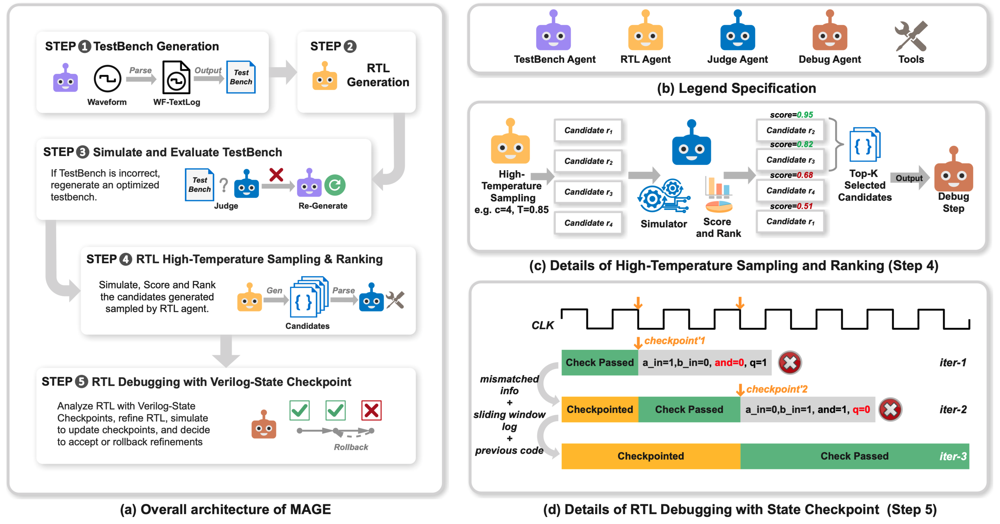

# MAGE: A Multi-Agent Engine for Automated RTL Code Generation

You can learn more on our Arxiv Paper: https://arxiv.org/abs/2412.07822.
MAGE is an open-source multi-agent LLM RTL code generator.



## Environment Set Up

### 1.> To install the repo itself:
```
git clone https://github.com/stable-lab/MAGE.git
cd MAGE

# Install conda first if it's not on your machine like "apt install conda"
# To confirm successful installation of conda, run "conda --version"
# Continue after successfully installed conda
conda create -n mage python=3.11 
conda activate mage
pip install -Ue .
```

### 2.>To set api key：
You can either:
1. Set "OPENAI_API_KEY", "ANTHROPIC_API_KEY" or other keys in your env variables
2. Set key.cfg file. Each line should be like:

```
OPENAI_API_KEY: 'xxxxxxx'
```

### To install iverilog {.tabset}
You'll need to install [ICARUS verilog](https://github.com/steveicarus/iverilog) 12.0
For latest installation guide, please refer to [iverilog official guide](https://steveicarus.github.io/iverilog/usage/installation.html)

#### Ubuntu (Local Compilation)
```
apt install -y autoconf gperf make gcc g++ bison flex
```
and
```
$ git clone https://github.com/steveicarus/iverilog.git && cd iverilog \
        && git checkout v12-branch \
        && sh ./autoconf.sh && ./configure && make -j4\
$ sudo make install
```
#### MacOS
```
brew install icarus-verilog
```

#### Version confirmation of iverilog
Please confirm the iverilog version is v12 by running
```
iverilog -v
```

First line of output is expected to be:
```
Icarus Verilog version 12.0 (stable) (v12_0)
```

### 3.>  Verilator Installation

```
# By apt
sudo apt install verilator

# By Compilation
git clone https://github.com/verilator/verilator
cd verilator
autoconf
export VERILATOR_ROOT=`pwd`
./configure
make -j4
```

### 4.> Pyverilog Installation

```
# pre require
pip3 install jinja2 ply

git clone https://github.com/PyHDI/Pyverilog.git
cd Pyverilog
# must to user dir, or error because no root
python3 setup.py install --user
```

### 5.> To get benchmarks

```
[verilog-eval](https://github.com/NVlabs/verilog-eval)
```

```
git clone https://github.com/NVlabs/verilog-eval
```

## File structure
```
.
├── README.md
├── action.yml
├── requirements.txt
├── setup.py
├── src
│   └── mage_rtl
│       ├── agent.py
│       ├── bash_tools.py
│       ├── benchmark_read_helper.py
│       ├── gen_config.py
│       ├── log_utils.py
│       ├── prompts.py
│       ├── rtl_editor.py
│       ├── rtl_generator.py
│       ├── sim_judge.py
│       ├── sim_reviewer.py
│       ├── tb_generator.py
│       ├── token_counter.py
│       └── utils.py
├── testbench_generate.ipynb
└── tests
    ├── test_llm_chat.py
    ├── test_rtl_generator.py
    ├── test_single_agent.py
    └── test_top_agent.py
```

## Run Guide
```
python tests/test_top_agent.py
```

Run arguments can be set in the file like:

```
args_dict = {
    "model": "claude-3-5-sonnet-20241022",
    "filter_instance": "^(Prob011_norgate)$",
    "type_benchmark": "verilog_eval_v2",
    "path_benchmark": "../verilog-eval",
    "run_identifier": "claude3.5sonnet_20241113_v2",
    "n": 1,
    "temperature": 0.85,
    "top_p": 0.95,
}
```
Where each argument means:
1. model: The LLM model used. Support for gpt-4o and claude has been verified.
2. filter_instance: A RegEx style instance name filter.
3. type_benchmark: Support running verilog_eval_v1 or verilog_eval_v2
4. path_benchmark: Where the benchmark repo is cloned
5. run_identifier: Unique name to disguish different runs
6. n: Number of repeated run to execute
7. temperature: Argument for LLM generation randomness. Usually between [0, 1]
8. top_p: Argument for LLM generation randomness. Usually between [0, 1]
